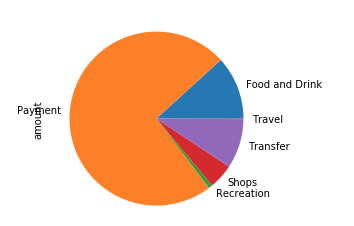
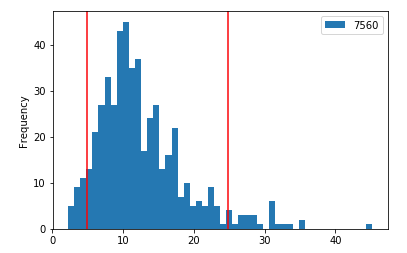
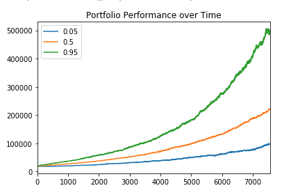

# How do you like them apps?


## Background

The Consumer Division of company X has decided to offer budgeting and financial planning services to customers. They want to build a report for customers that links to their banking and investment accounts and automatically refreshes the data and charts on login. However, some of the calculations are tricky, and they could really use some help connecting the accounts and simulating the retirement investment projections. Luckily, there are APIs available to obtain account transactions and fetch retirement portfolio prices.

In this project, I helped company X complete the following tasks:

1. [Budget Analysis with Plaid](#Budget-Analysis)

2. [Retirement Planner](#Retirement-Planner)

3. [Financial Report](#Financial-Report)

---

### Files

* [Budget Starter Notebook](Starter_Code/account_summary.ipynb)

* [Retirement Planner Starter Notebook](Starter_Code/portfolio_planner.ipynb)

---


__Note__: The data produced from the api calls will vary depending on the dates used, causing results that vary from those pictured.

### Budget Analysis

In this section, I used the Plaid API to obtain transaction and account data for the budget analysis section of the report.

I Followed the steps outlined in the budget starter notebook (`account_summary.ipynb`) to complete the following:

1. Generate a Plaid access token to access the Developer Sandbox.

2. Use the Access token to fetch account transactions from the sandbox. You should fetch the last 90 days of transactions from the sandbox using the following institution:

    ```python
    INSTITUTION_ID = "ins_109508"
    ```

3. Perform basic budget analysis on the sandbox transaction and generate the following plots:

    * Spending Categories Pie Chart.

      

    * Spending Per Month Bar Chart.

      

4. Use the API to fetch income data from the sandbox and print the following:

* Last Year's Income Before Tax.

* Current Monthly Income.

* Projected Year's Income Before Tax.

### Retirement Planner

In this section, I used the Alpaca API to fetch historical closing prices for a retirement portfolio and then run Monte Carlo simulations to project the portfolio performance at `30` years. I then used the Monte Carlo data to answer questions about the portfolio.


#### Monte Carlo Simulation

I Created a Monte Carlo simulation for the retirement portfolio:

1. Use the Alpaca API to fetch historical closing prices for a traditional 60/40 portfolio using the `SPY` and `AGG` tickers to represent the `60%` stocks (`SPY`) and `40%` bonds (`AGG`).

2. Run a Monte Carlo Simulation of `500` runs and `30` years for the `60/40` portfolio and plot the results.

    

3. Select the ending cumulative returns from the Monte Carlo simulation and calculate the interval values for a `90`% confidence interval.

4. Using the ending cumulative returns, plot a histogram of the results and plot the `90%` confidence interval as vertical lines on the histogram.

    

#### Retirement Analysis

I used the Monte Carlo simulation data to answer the following questions:

1. What are the expected cumulative returns at `30` years for the `10th`, `50th`, and `90th` percentiles?

2. Given an initial investment of `$20,000`, what is the expected return in dollars at the `10th`, `50th`, and `90th` percentiles?

3. Given the current projected annual income from the Plaid analysis, will a `4%` withdrawal rate meet or exceed that value at the `10th` percentile? Note: This is basically determining if retirement income is equivalent to current income.

4. How would a `50%` increase in the initial investment amount affect the `4%` retirement withdrawal? In other words, what happens if the initial investment had been bigger?

5. (Optional Challenge) Use the Monte Carlo data and calculate the cumulative returns at the `5%`, `50%`, and `95%` quartiles and plot this data as a line chart to see how the cumulative returns change over the life of the investment.

    

### Financial Report

In this section, I compiled a financial report to demo my calculations to the Consumer App Team. The report was written as a markdown file and included the following sections:

1. **Budget Analysis:** Summarize the transaction data from the budget analysis and include images for each chart and table produced.

2. *Retirement Planning:* Summarize the retirement portfolio analysis and include the charts for the Monte Carlo simulation.


### Resources

* [Plaid API Docs](https://plaid.com/docs/)

* [AlpacaDOCS](https://alpaca.markets/docs/)
